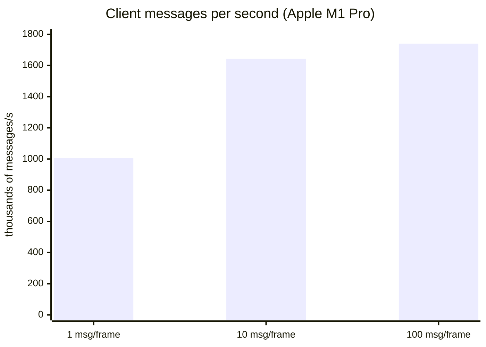
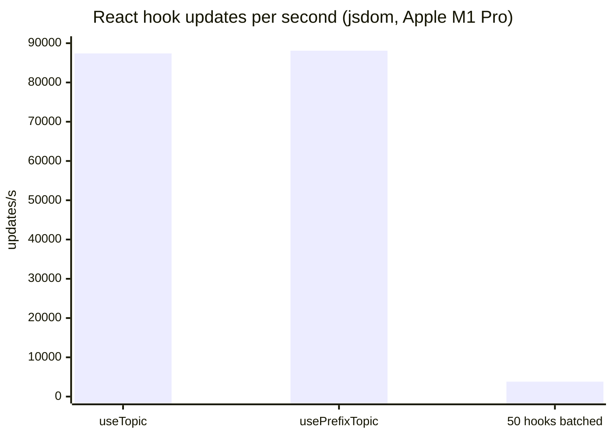

# ntcore-ts

TypeScript and React libraries for [WPILib's NetworkTables 4.1 protocol](https://github.com/wpilibsuite/allwpilib/blob/main/ntcore/doc/networktables4.adoc), plus an optional MCP server for agent tooling.

https://github.com/user-attachments/assets/eddf89b3-25c1-441b-aea5-357e49edd20e

> Live subscribe/publish dashboard (`apps/example-react`) talking to `apps/example-robot` over NT 4.1. Try it locally: start the robot (`npm run serve -w @ntcore-ts/example-robot`), then the dashboard (`npm run serve -w @ntcore-ts/example-react`).

## Features

- NodeJS and DOM support
- Togglable auto-reconnect
- Callbacks for new data on subscriptions
- Callbacks for connection listeners
- Wildcard prefix listeners for multiple topics
- Protobuf support with optional type generation and Zod validation
- Struct support for WPILib types (`getStructTopic(name, Pose2d)`, `useStructTopic(name, Pose2d)`)
- Retrying for messages queued during a connection loss
- On-the-fly server switching with resubscribing and republishing
- Generic types for Topics
- Client-side data validation using [Zod](https://github.com/colinhacks/zod)
- Server-matching timestamping using RTT calculation
- Granular logging with configurable log levels per module
- MCP server (`@ntcore-ts/mcp`) for agent live NT introspection with gated writes

## Performance

The client can decode about **1 million** NT frames per second. React `useTopic` applies about **87 thousand** updates per second. A 50-widget dashboard, all updating in one React batch, still does about **3,800** full refreshes per second.

Typical FRC traffic is tens to low thousands of updates per second. The network and NT server saturate first.





| Workload                          |                       Rate |   Mean |
| --------------------------------- | -------------------------: | -----: |
| Client, 1 message / frame         |                    1.01M/s | 1.2 µs |
| Client, 100 messages / frame      | 17k frames/s (1.74M msg/s) |  73 µs |
| React `useTopic` (one update)     |                      87k/s |  12 µs |
| React 50-hook dashboard (batched) |                     3.8k/s | 278 µs |

Numbers are from `npm run bench` on an Apple M1 Pro, Node 24. CI re-runs the same suite on every PR and fails if throughput drops to half of `main`. Details: [performance guide](https://ntcore.chrislawson.dev/guide/performance).

## Documentation

Guides and API reference: [https://ntcore.chrislawson.dev](https://ntcore.chrislawson.dev)

## Install

```bash
npm install --save @ntcore-ts/client
```

React dashboards:

```bash
npm install @ntcore-ts/react @ntcore-ts/client react react-dom
```

MCP (Cursor / Claude Desktop):

```bash
npm install -g @ntcore-ts/mcp
# or: npx ntcore-ts-mcp
```

See the [MCP guide](https://ntcore.chrislawson.dev/guide/mcp) (or [`packages/mcp/README.md`](packages/mcp/README.md)) for `mcp.json` examples and write-gate env vars.

```typescript
import { NetworkTables } from '@ntcore-ts/client';

const ntcore = NetworkTables.getInstanceByTeam(973);
const gyro = ntcore.getDoubleTopic('/MyTable/Gyro');
gyro.subscribe((value) => console.log(value));
```

More detail: [Getting started](https://ntcore.chrislawson.dev/guide/getting-started) and the [React guide](https://ntcore.chrislawson.dev/guide/react).

## Packages

| Package                                | Description                    |
| -------------------------------------- | ------------------------------ |
| [`@ntcore-ts/client`](packages/client) | Core NetworkTables 4.1 client  |
| [`@ntcore-ts/react`](packages/react)   | React provider and hooks       |
| [`@ntcore-ts/mcp`](packages/mcp)       | MCP server for live NT (stdio) |

## Contributing

Contributions are welcome. See [CONTRIBUTING.md](CONTRIBUTING.md) for setup and PR guidelines.
