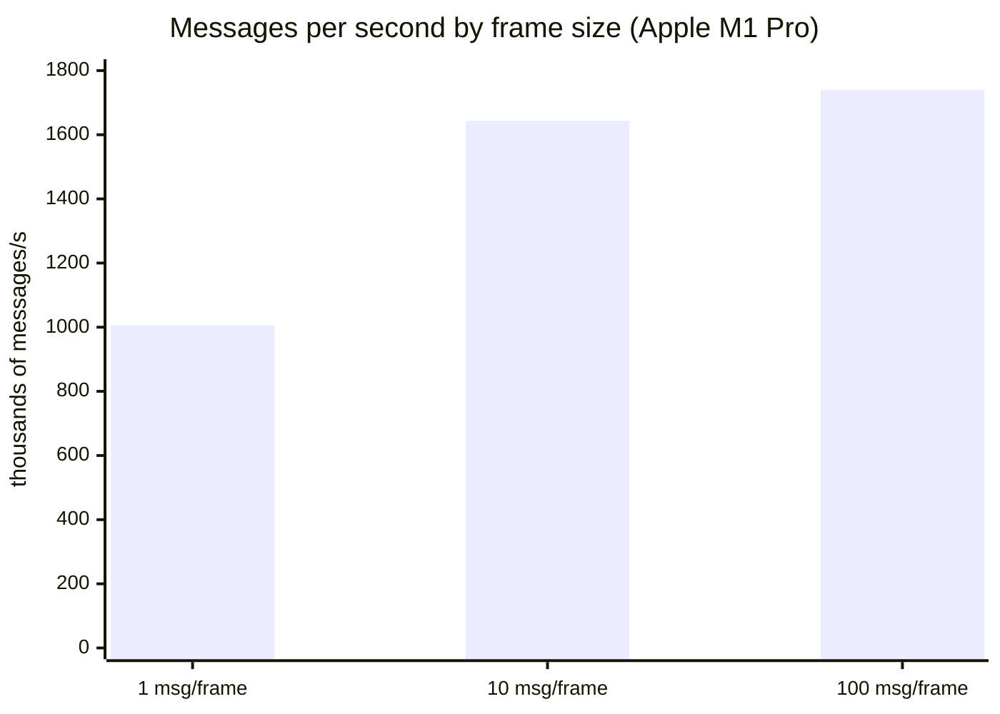

# @ntcore-ts/client

TypeScript client for [WPILib's NetworkTables 4.1 protocol](https://github.com/wpilibsuite/allwpilib/blob/main/ntcore/doc/networktables4.adoc).

## Documentation

Full guides and API reference: [https://ntcore.chrislawson.dev](https://ntcore.chrislawson.dev)

## Install

```bash
npm install --save @ntcore-ts/client
```

```typescript
import { NetworkTables } from '@ntcore-ts/client';

const ntcore = NetworkTables.getInstanceByTeam(973);
const gyro = ntcore.getDoubleTopic('/MyTable/Gyro');
gyro.subscribe((value) => console.log(value));
```

The hot path (msgpack decode + schema parse) is about **1 million frames/s** on an Apple M1 Pro (~1.2 µs per single-message frame). Typical FRC NT rates are tens to low thousands of updates per second.



## Building

Run `npm run build -w @ntcore-ts/client` (or `npx turbo run build --filter=@ntcore-ts/client`) to build the library.

## Running unit tests

Run `npm run test -w @ntcore-ts/client` (or `npm test` from the repo root) to execute the unit tests via [Vitest](https://vitest.dev).

## Benchmarks

Benchmarks measure how fast the client processes WebSocket messages. They are **not** run in the default test suite.

**How to run**

- From the repo root: `npm run bench` (client and React)
- From this package: `npm run bench -w @ntcore-ts/client`

**What is measured**

- **Tier 1 (hot path)**: Binary frame processing in isolation—decode (msgpack), schema parse, and callback. Benchmarks: one frame with 1, 10, or 100 messages.
- **Tier 2 (`onMessage`)**: 100 binary frames through `onMessage` → `handleBinaryFrame` → `onTopicUpdate`.

Both tiers use a mock server for the socket connection (no real NT server or robot). Results are reported as Hz (ops/sec), with min/max/mean and percentiles (e.g. p99).

**Findings** (Apple M1 Pro, Node 24)

| Workload                       | Frames or batches/s |   Mean | Messages/s |
| ------------------------------ | ------------------: | -----: | ---------: |
| 1 message / frame              |               1.01M | 1.2 µs |      1.01M |
| 10 messages / frame            |                164k | 7.8 µs |      1.64M |
| 100 messages / frame           |                 17k |  73 µs |      1.74M |
| 100 frames through `onMessage` |                6.3k | 159 µs |       632k |

CI re-runs these benches on every PR and fails if throughput drops to half of `main`. See the [performance guide](https://ntcore.chrislawson.dev/guide/performance).

**Conclusion**: For normal FRC/NetworkTables use (tens to low thousands of topic updates per second over the network), the client can process far more than real traffic. The bottleneck in practice is the **network** (latency, bandwidth) and the NT server, not this client’s message processing.
