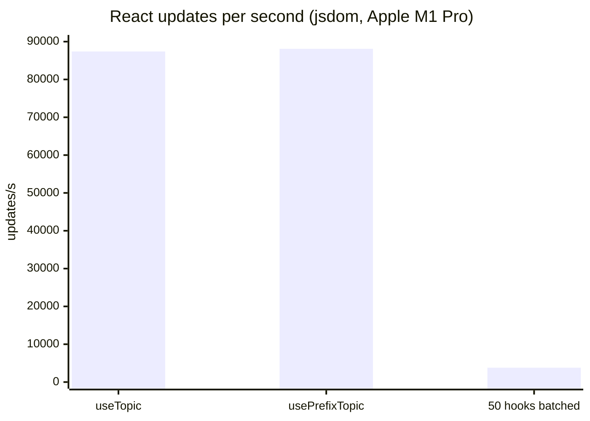

# @ntcore-ts/react

React bindings for [@ntcore-ts/client](https://github.com/cjlawson02/ntcore-ts) (NetworkTables for FRC). Provides a context provider and hooks so components can subscribe to topics and connection status without managing lifecycle by hand.

Requires **React 18+** and **@ntcore-ts/client**.

## Documentation

Full React guide and API reference: [https://ntcore.chrislawson.dev/guide/react](https://ntcore.chrislawson.dev/guide/react)

## Installation

```bash
npm install @ntcore-ts/react @ntcore-ts/client react react-dom
```

```tsx
import { NtcoreProvider, useTopic, useConnectionStatus, NetworkTablesTypeInfos } from '@ntcore-ts/react';

function App() {
  return (
    <NtcoreProvider team={973}>
      <Dashboard />
    </NtcoreProvider>
  );
}

function Dashboard() {
  const { connected } = useConnectionStatus();
  const { value: gyro } = useTopic<number>('/MyTable/Gyro', NetworkTablesTypeInfos.kDouble);
  return (
    <p>
      {connected ? 'Connected' : 'Disconnected'} — Gyro: {gyro ?? '—'}
    </p>
  );
}
```

A single `useTopic` update is about **87k/s** (~12 µs). A 50-hook dashboard updating in one React batch is about **3.8k** full refreshes/s (~278 µs). That is far above typical FRC NT rates.



## Running unit tests

Run `npm run test -w @ntcore-ts/react` to execute the unit tests via [Vitest](https://vitest.dev/).

## Benchmarks

Hook update benches measure `useTopic` / `usePrefixTopic` from callback to a jsdom DOM commit. They are **not** run in the default test suite.

- From the repo root: `npm run bench` (client and React)
- From this package: `npm run bench -w @ntcore-ts/react`

On an Apple M1 Pro (jsdom):

| Workload                      |   Rate |    Mean |
| ----------------------------- | -----: | ------: |
| `useTopic` (one update)       |  87k/s |   12 µs |
| `usePrefixTopic` (one update) |  88k/s |   12 µs |
| 50 hooks, one batched update  | 3.8k/s |  278 µs |
| 50 hooks, unbatched           |  746/s | 1.37 ms |

CI re-runs these benches on every PR and fails if throughput drops to half of `main`. See the [performance guide](https://ntcore.chrislawson.dev/guide/performance).
